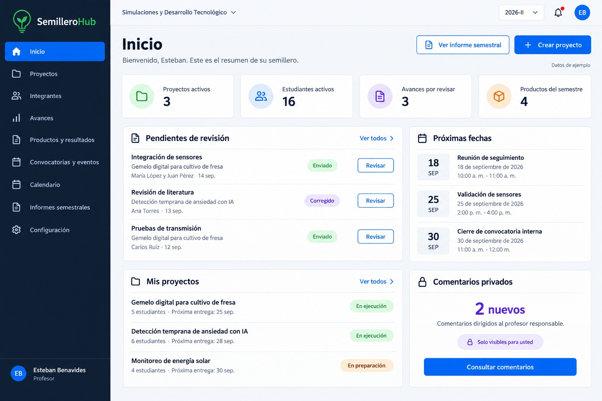
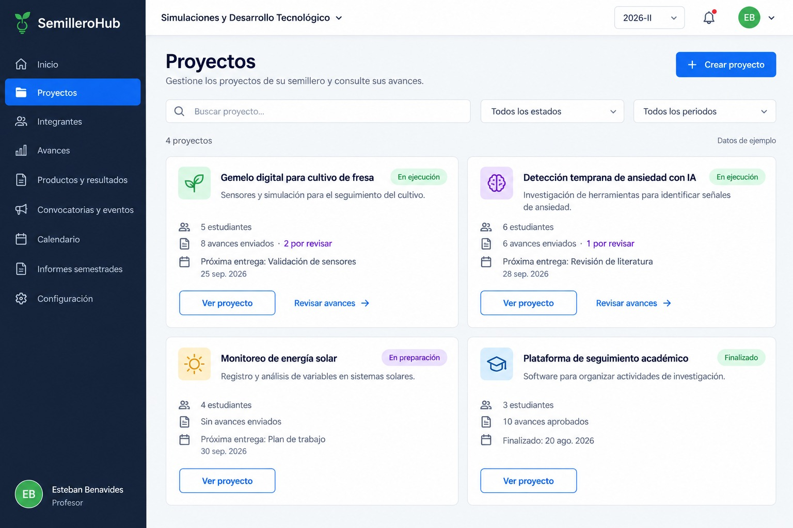
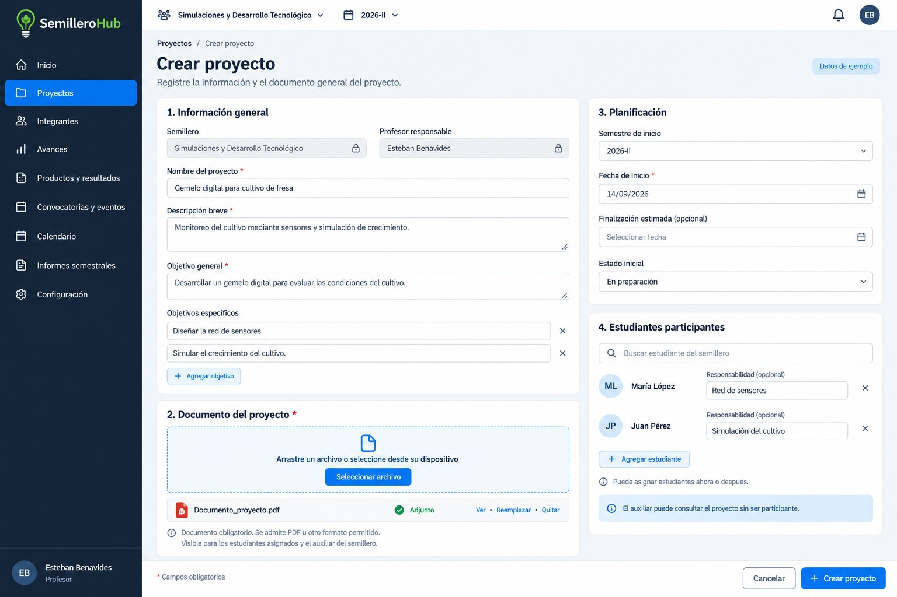
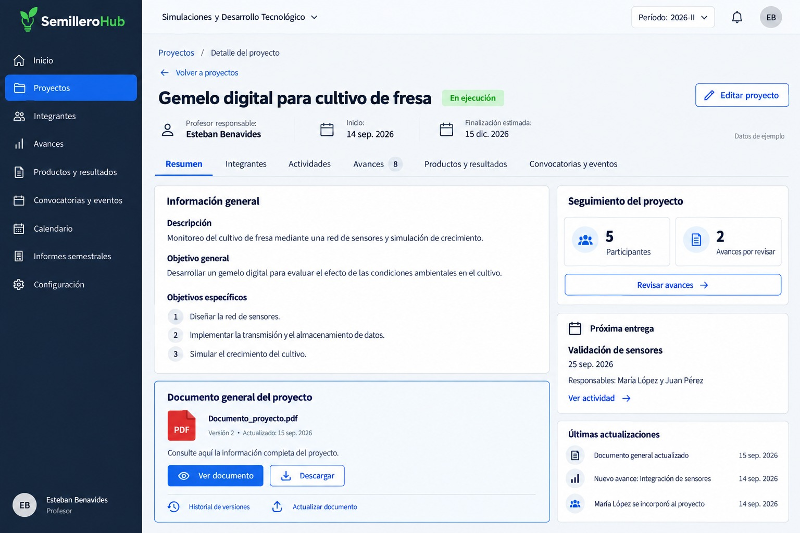
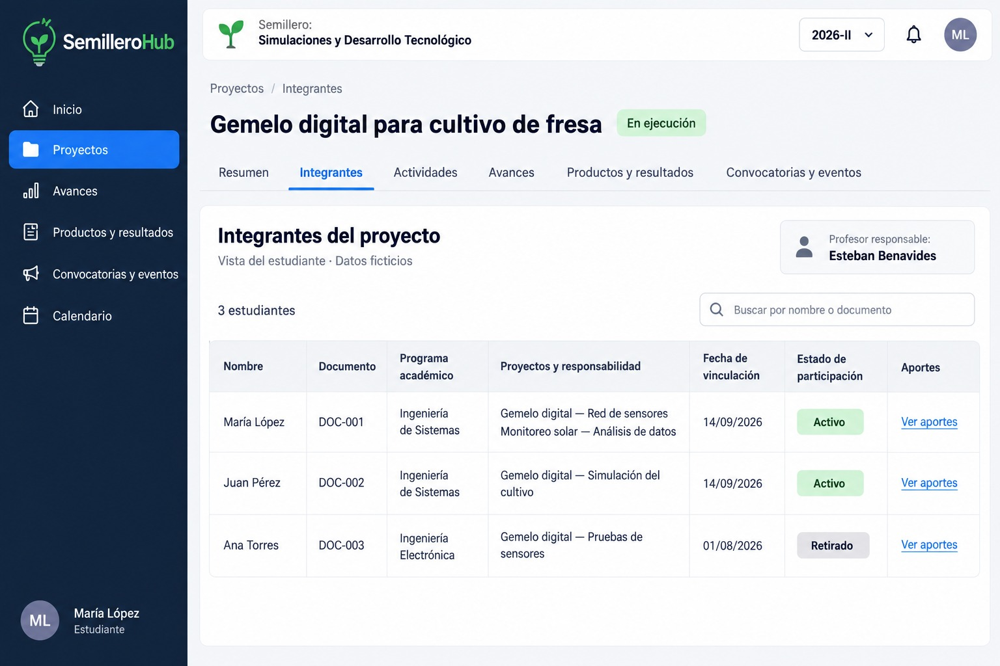
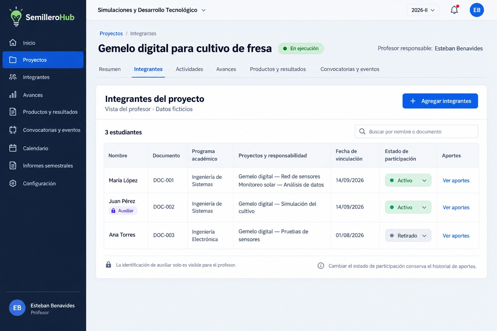
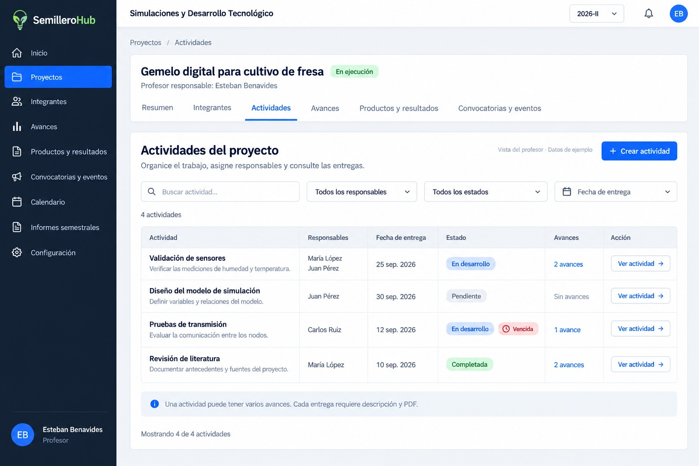

# SemilleroHub

Plataforma para la gestión de semilleros de investigación: proyectos, integrantes, actividades, avances y productos. Este documento describe el funcionamiento de cada pantalla, pensado como referencia para desarrollo y como guía funcional del sistema.

> 📌 Los datos mostrados en las capturas (`docs/images/`) son ficticios / de ejemplo.

## Tabla de contenido

1. [Inicio del profesor](#1-inicio-del-profesor)
2. [Listado de proyectos — Profesor](#2-listado-de-proyectos--profesor)
3. [Crear proyecto](#3-crear-proyecto)
4. [Detalle del proyecto — Resumen](#4-detalle-del-proyecto--resumen)
5. [Integrantes del proyecto — Estudiante](#5-integrantes-del-proyecto--estudiante)
6. [Integrantes del proyecto — Profesor](#6-integrantes-del-proyecto--profesor)
7. [Iniciar sesión](#7-iniciar-sesión)
8. [Actividades del proyecto](#8-actividades-del-proyecto)
9. [Crear actividad](#9-crear-actividad)

---

## 1. Inicio del profesor

Primera pantalla después de ingresar. Resume el trabajo del semillero durante el semestre seleccionado.

- **Tarjetas resumen**: proyectos activos, estudiantes activos, avances pendientes de revisión y productos registrados.
- **Pendientes de revisión**: abre las entregas que requieren comentarios o aprobación.
- **Mis proyectos**: entra al detalle de cada proyecto.
- **Próximas fechas**: reúne entregas, reuniones y cierres de convocatorias.
- **Comentarios privados**: indica mensajes nuevos dirigidos al profesor, sin mostrar su contenido en el resumen.
- Botones superiores: **Crear proyecto** y **Ver informe semestral**.

## 2. Listado de proyectos — Profesor

Organiza los proyectos del semillero en tarjetas, cada una con nombre, descripción breve, estado, participantes, avances y próxima entrega.

- Búsqueda por nombre y filtros por estado o periodo.
- Acceso directo a los avances por revisar de cada proyecto.
- **Crear proyecto** es exclusivo del profesor.
- Los proyectos que continúan durante varios semestres conservan su historial.

## 3. Crear proyecto

Registro de un proyecto en cuatro bloques:

| Bloque | Funcionamiento |
|---|---|
| Información general | Nombre, descripción y objetivos. Semillero y profesor responsable se asignan automáticamente. |
| Documento del proyecto | Exige adjuntar el archivo con la información completa. Visible para participantes y auxiliar. |
| Planificación | Semestre de inicio, fechas y estado inicial. |
| Estudiantes participantes | Selección de estudiantes ya registrados y asignación de responsabilidades (también se pueden incorporar después). |

Al seleccionar **Crear proyecto** se validan los campos obligatorios y el documento adjunto; si todo está completo, se abre el detalle del proyecto.

## 4. Detalle del proyecto — Resumen

Reúne descripción, objetivos, profesor responsable, fechas y estado del proyecto.

- El documento general se puede **visualizar, descargar y consultar por versiones**.
- Solo el profesor puede actualizarlo o editar la información del proyecto.
- Columna lateral: participantes, avances pendientes, próxima entrega y últimas actualizaciones.
- Pestañas: Resumen, Integrantes, Actividades, Avances, Productos, Convocatorias.

## 5. Integrantes del proyecto — Estudiante

Vista de solo consulta. Permite ver:

- Nombre y documento.
- Programa académico.
- Proyectos y responsabilidad.
- Fecha de vinculación.
- Estado de participación.
- **Ver aportes**, para consultar las contribuciones del estudiante.

No permite cambiar estados ni identificar quién es auxiliar.

## 6. Integrantes del proyecto — Profesor

Muestra los mismos datos que la vista de estudiante, pero agrega:

- Acción para **agregar integrantes**.
- Acción para **cambiar el estado de participación**.
- Indicador privado para identificar al **auxiliar** (independiente del estado Activo/Retirado).

Cuando un estudiante se retira, sus avances y aportes se conservan para mantener el historial y elaborar los informes.

## 7. Iniciar sesión

*(Pantalla definida, pendiente de imagen)*

Solicita usuario o correo y contraseña. El sistema identifica los permisos de la cuenta y abre la vista correspondiente.

- Las cuentas las crea el administrador.
- No habrá registro público ni selección libre del rol.

## 8. Actividades del proyecto

Define qué deben realizar los estudiantes, quiénes son responsables y cuándo deben entregar. Una **actividad** representa el trabajo planificado; un **avance** documenta el trabajo realizado.

| Elemento | Contenido o acción |
|---|---|
| Encabezado | Nombre del proyecto y pestaña Actividades seleccionada. |
| Buscador y filtros | Buscar por título; filtrar por responsable, estado o fecha. |
| Crear actividad | Botón exclusivo del profesor. |
| Listado | Título, responsables, fecha de entrega, estado y número de avances asociados. |
| Ver actividad | Abre las instrucciones y los avances relacionados. |

**Estados**: Pendiente, En desarrollo, Completada. La etiqueta **"Vencida"** aparece automáticamente cuando pasa la fecha de entrega y la actividad sigue sin completarse (complementa el estado, no lo reemplaza).

Una misma actividad puede tener varios avances. Aprobar un avance no completa automáticamente la actividad: el profesor determina cuándo se ha cumplido todo lo solicitado.

**Permisos dentro de una actividad:**

- **Profesor**: crea y edita actividades, asigna responsables, revisa avances y marca la actividad como completada.
- **Estudiante responsable**: presenta avances individuales o grupales (identificando autores y aportes en entregas grupales). Cada avance requiere descripción y **PDF obligatorio**.
- **Auxiliar**: consulta avances y envía comentarios privados al profesor, sin aprobarlos. Si también participa en la actividad, puede presentar avances.

## 9. Crear actividad

Formulario para que el profesor responsable defina el trabajo de los estudiantes:

| Sección | Funcionamiento |
|---|---|
| Información de la actividad | Muestra automáticamente el proyecto. Título e instrucciones obligatorios. |
| Estudiantes responsables | Búsqueda por nombre o documento; selección de uno o varios integrantes activos del proyecto. |
| Planificación | Fecha de entrega obligatoria. La actividad se crea con estado **Pendiente**. |
| Documento de la actividad o convocatoria | Adjuntar (opcional) guía, bases de convocatoria o formato de trabajo. |
| Enlaces de apoyo | Referencias o recursos complementarios (opcional). |

Al seleccionar un archivo se muestran las opciones **Ver, Reemplazar y Quitar**. Tras guardar, el documento queda asociado a la actividad para consulta y descarga por los estudiantes del proyecto y el auxiliar; las actualizaciones posteriores conservan versiones anteriores.

Los responsables pueden presentar avances individuales o grupales; cada avance requiere descripción y **PDF obligatorio**, independiente del documento opcional de la actividad.

El botón **Crear actividad** valida los campos obligatorios, guarda la información y abre el detalle. **Cancelar** regresa al listado y, si hay cambios sin guardar, pide confirmar que se desean descartar.

---

## Roles del sistema

| Rol | Permisos generales |
|---|---|
| **Profesor** | Crea proyectos y actividades, gestiona integrantes, revisa y aprueba avances, identifica al auxiliar. |
| **Estudiante** | Consulta proyectos e integrantes, presenta avances de sus actividades asignadas. |
| **Auxiliar** | Consulta proyectos y avances, envía comentarios privados al profesor; puede presentar avances si participa en la actividad. |

## Estados

- **Proyecto**: En preparación, En ejecución, Finalizado.
- **Actividad**: Pendiente, En desarrollo, Completada (+ etiqueta "Vencida" cuando aplica).
- **Participación**: Activo, Retirado.
